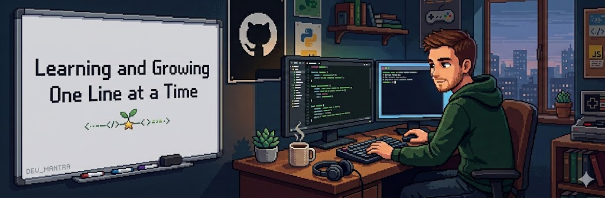

<!-- PROFILE BANNER -->

  

<h1 align="center">👋 Hi, I’m Allan Jay V. Busante</h1>

  <strong style="color:#0ea5e9;">
    🚀 Software Developer | Lifelong Learner
  </strong>

---

## 📫 Connect With Me

  
  
  
  

---

## 🛠️ Tech Stack

### 🎨 Frontend

### 🧠 Backend & AI

### 🧰 Tools

---

💬 Always open to learning, collaboration, and meaningful tech discussions.

  ✨ “Learning and Growing One Line at a Time” ✨

